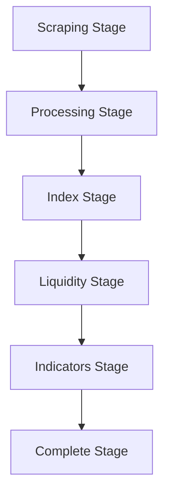

# Pipeline Operations Skill - EOD Data Processing Workflows

## Purpose
Expert knowledge in end-of-day (EOD) data processing pipeline operations, specifically optimized for ISX Pulse's revolutionary pipeline-based indicator pre-calculation architecture.

## Pipeline Architecture Overview

### 5-Stage Processing Pipeline


### Stage Dependencies
- **Sequential Processing**: Each stage must complete before next begins
- **Data Validation**: Each stage validates input before processing
- **Error Handling**: Failed stages trigger rollback mechanisms
- **Resource Management**: Efficient CPU/memory usage during processing

## Stage-Specific Expertise

### 1. Scraping Stage (Data Acquisition)
**Purpose**: Download ISX Excel reports and market data

**Key Operations**:
```go
type ScrapingStage struct {
    sourceURL    string
    downloadPath string
    httpClient   *http.Client
    retryCount   int
}

func (s *ScrapingStage) Execute(ctx context.Context) error {
    // Download market summary Excel
    marketData, err := s.downloadMarketSummary(ctx)
    if err != nil {
        return fmt.Errorf("market summary download failed: %w", err)
    }

    // Download price list Excel
    priceData, err := s.downloadPriceList(ctx)
    if err != nil {
        return fmt.Errorf("price list download failed: %w", err)
    }

    // Validate file integrity
    if err := s.validateFiles(marketData, priceData); err != nil {
        return fmt.Errorf("file validation failed: %w", err)
    }

    return s.saveFiles(marketData, priceData)
}
```

**ISX-Specific Considerations**:
- **Trading Hours**: Process only after market close (4:30 PM Iraq time)
- **File Formats**: Handle ISX Excel format variations
- **Data Completeness**: Ensure all 90+ tickers have data
- **Holiday Schedule**: Skip processing on Iraqi holidays

### 2. Processing Stage (Data Transformation)
**Purpose**: Convert Excel files to validated CSV format

**Key Operations**:
```go
type ProcessingStage struct {
    excelParser  *ExcelParser
    csvWriter    *CSVWriter
    validator    *DataValidator
    outputPath   string
}

func (p *ProcessingStage) Execute(ctx context.Context, input ScrapeOutput) error {
    // Parse Excel files
    marketData, err := p.excelParser.ParseMarketSummary(input.MarketFile)
    if err != nil {
        return fmt.Errorf("market data parsing failed: %w", err)
    }

    priceData, err := p.excelParser.ParsePriceList(input.PriceFile)
    if err != nil {
        return fmt.Errorf("price data parsing failed: %w", err)
    }

    // Validate data consistency
    if err := p.validator.ValidateConsistency(marketData, priceData); err != nil {
        return fmt.Errorf("data consistency validation failed: %w", err)
    }

    // Transform to standard CSV format
    csvData := p.transformToCSV(marketData, priceData)

    // Write validated CSV
    return p.csvWriter.Write(csvData, p.outputPath)
}
```

**Data Validation Rules**:
- **Price Range**: Validate price ranges against historical patterns
- **Volume Consistency**: Check for zero or negative volumes
- **Ticker Validation**: Verify all ticker symbols follow ISX format
- **Date Consistency**: Ensure trading date matches current business day

### 3. Index Stage (ISX60 Extraction)
**Purpose**: Extract and process ISX60 index data

**Key Operations**:
```go
type IndexStage struct {
    indexCalculator *IndexCalculator
    historicalData  *IndexHistory
    outputWriter    *IndexWriter
}

func (i *IndexStage) Execute(ctx context.Context, input ProcessingOutput) error {
    // Extract ISX60 constituent data
    constituents, err := i.extractISX60Constituents(input.CSVData)
    if err != nil {
        return fmt.Errorf("ISX60 extraction failed: %w", err)
    }

    // Calculate index value
    indexValue, err := i.indexCalculator.CalculateIndex(constituents)
    if err != nil {
        return fmt.Errorf("index calculation failed: %w", err)
    }

    // Update historical data
    if err := i.historicalData.Update(indexValue); err != nil {
        return fmt.Errorf("historical update failed: %w", err)
    }

    // Write index data
    return i.outputWriter.WriteIndexData(indexValue)
}
```

### 4. Liquidity Stage (Market Liquidity Analysis)
**Purpose**: Calculate liquidity metrics and trading analysis

**Key Operations**:
```go
type LiquidityStage struct {
    liquidityCalculator *LiquidityCalculator
    marketAnalyzer      *MarketAnalyzer
}

func (l *LiquidityStage) Execute(ctx context.Context, input IndexOutput) error {
    // Calculate liquidity metrics for all tickers
    liquidityMetrics := make(map[string]*LiquidityMetrics)

    for ticker, priceData := range input.PriceData {
        metrics, err := l.liquidityCalculator.Calculate(ticker, priceData)
        if err != nil {
            slog.WarnContext(ctx, "liquidity calculation failed",
                "ticker", ticker,
                "error", err)
            continue
        }
        liquidityMetrics[ticker] = metrics
    }

    // Analyze market liquidity patterns
    marketLiquidity, err := l.marketAnalyzer.AnalyzeMarketLiquidity(liquidityMetrics)
    if err != nil {
        return fmt.Errorf("market liquidity analysis failed: %w", err)
    }

    // Store liquidity data
    return l.storeLiquidityData(liquidityMetrics, marketLiquidity)
}
```

### 5. Indicators Stage (Technical Indicator Pre-calculation)
**Purpose**: Calculate all technical indicators for all tickers (revolutionary stage)

**Key Operations**:
```go
type IndicatorsStage struct {
    indicatorService *UniversalIndicatorService
    calculator       *IndicatorCalculator
    ssotManager      *SSOTManager
}

func (i *IndicatorsStage) Execute(ctx context.Context, input LiquidityOutput) error {
    // Load processed price data
    priceData, err := i.loadPriceData(input.CSVPath)
    if err != nil {
        return fmt.Errorf("price data load failed: %w", err)
    }

    // Pre-calculate all indicators for all tickers
    tickerIndicators := make(map[string]*TickerIndicators)

    for ticker, data := range priceData {
        indicators, err := i.calculator.CalculateAllIndicators(ticker, data)
        if err != nil {
            return fmt.Errorf("indicator calculation failed for %s: %w", ticker, err)
        }
        tickerIndicators[ticker] = indicators
    }

    // Create SSOT file (ticker_indicators.csv)
    ssotFile, err := i.ssotManager.CreateSSOTFile(tickerIndicators)
    if err != nil {
        return fmt.Errorf("SSOT creation failed: %w", err)
    }

    // Update universal indicator service cache
    return i.indicatorService.UpdateCache(tickerIndicators)
}
```

**Revolutionary Benefits**:
- **Sub-millisecond Access**: All indicators pre-calculated and instantly accessible
- **Consistency**: Single source of truth eliminates calculation inconsistencies
- **Performance**: No runtime calculations during user interactions
- **Scalability**: Handles all ISX tickers with consistent performance

## Pipeline Coordination Patterns

### Stage Orchestration
```go
type PipelineOrchestrator struct {
    stages []PipelineStage
    context context.Context
    cancel  context.CancelFunc
}

func (p *PipelineOrchestrator) Execute() error {
    // Create pipeline context with timeout
    p.context, p.cancel = context.WithTimeout(context.Background(), 2*time.Hour)
    defer p.cancel()

    // Execute stages sequentially
    stageOutput := make(map[string]interface{})

    for _, stage := range p.stages {
        // Check dependencies
        if err := p.checkDependencies(stage, stageOutput); err != nil {
            return fmt.Errorf("dependency check failed for %s: %w", stage.Name(), err)
        }

        // Execute stage
        slog.InfoContext(p.context, "executing stage",
            "stage", stage.Name(),
            "timestamp", time.Now().Format(time.RFC3339))

        output, err := stage.Execute(p.context, stageOutput)
        if err != nil {
            return fmt.Errorf("stage %s failed: %w", stage.Name(), err)
        }

        // Store stage output
        stageOutput[stage.Name()] = output

        // Broadcast progress via WebSocket
        p.broadcastProgress(stage.Name(), 100.0/float64(len(p.stages)))
    }

    return nil
}
```

### Error Recovery Mechanisms
```go
type ErrorRecovery struct {
    retryPolicy   *RetryPolicy
    rollbackPlan  *RollbackPlan
    alerting      *AlertingService
}

func (e *ErrorRecovery) HandleStageFailure(stage PipelineStage, err error) error {
    // Log detailed error information
    slog.ErrorContext(context.Background(), "pipeline stage failed",
        "stage", stage.Name(),
        "error", err,
        "timestamp", time.Now(),
        "trace_id", middleware.GetTraceID(context.Background()))

    // Attempt retry if appropriate
    if e.retryPolicy.ShouldRetry(err) {
        if retryErr := e.retryStage(stage); retryErr == nil {
            return nil // Recovery successful
        }
    }

    // Execute rollback plan
    if rollbackErr := e.rollbackPlan.Execute(stage); rollbackErr != nil {
        return fmt.Errorf("rollback failed: %w", rollbackErr)
    }

    // Send alert
    e.alerting.SendAlert(Alert{
        Type:        "pipeline_failure",
        Stage:       stage.Name(),
        Error:       err.Error(),
        Severity:    "critical",
        Timestamp:   time.Now(),
    })

    return fmt.Errorf("stage %s failed and rollback completed: %w", stage.Name(), err)
}
```

## Performance Optimization

### Concurrent Processing
```go
func (i *IndicatorsStage) calculateIndicatorsConcurrently(tickers map[string]*PriceData) error {
    const batchSize = 10
    const workers = 4

    tickerChan := make(chan string, len(tickers))
    resultChan := make(chan *IndicatorResult, len(tickers))
    errorChan := make(chan error, len(tickers))

    // Start workers
    var wg sync.WaitGroup
    for w := 0; w < workers; w++ {
        wg.Add(1)
        go func(workerID int) {
            defer wg.Done()
            for ticker := range tickerChan {
                result, err := i.calculateTickerIndicators(ticker, tickers[ticker])
                if err != nil {
                    errorChan <- fmt.Errorf("worker %d failed for %s: %w", workerID, ticker, err)
                    continue
                }
                resultChan <- result
            }
        }(w)
    }

    // Dispatch work
    go func() {
        for ticker := range tickers {
            tickerChan <- ticker
        }
        close(tickerChan)
    }()

    // Wait for completion
    wg.Wait()
    close(resultChan)
    close(errorChan)

    // Check for errors
    if len(errorChan) > 0 {
        return <-errorChan // Return first error
    }

    // Collect results
    for result := range resultChan {
        i.storeIndicatorResult(result)
    }

    return nil
}
```

### Memory Management
```go
func (p *ProcessingStage) processLargeDataset(excelFile string) error {
    // Stream process Excel file to avoid loading entire file into memory
    reader, err := NewExcelStreamReader(excelFile)
    if err != nil {
        return err
    }
    defer reader.Close()

    csvWriter := NewCSVWriter(outputPath)
    defer csvWriter.Close()

    // Process rows in batches
    batchSize := 1000
    batch := make([]CSVRow, 0, batchSize)

    for reader.Next() {
        row, err := reader.ReadRow()
        if err != nil {
            return err
        }

        // Validate and transform row
        if validatedRow := p.validateAndTransform(row); validatedRow != nil {
            batch = append(batch, *validatedRow)

            // Write batch when full
            if len(batch) >= batchSize {
                if err := csvWriter.WriteBatch(batch); err != nil {
                    return err
                }
                batch = batch[:0] // Reset batch
            }
        }
    }

    // Write remaining rows
    if len(batch) > 0 {
        return csvWriter.WriteBatch(batch)
    }

    return nil
}
```

## Monitoring and Observability

### Pipeline Metrics
```go
type PipelineMetrics struct {
    TotalDuration      time.Duration            `json:"total_duration"`
    StageDurations     map[string]time.Duration `json:"stage_durations"`
    RecordsProcessed   int                      `json:"records_processed"`
    ErrorCount         int                      `json:"error_count"`
    MemoryUsage        int64                    `json:"memory_usage_bytes"`
    CacheHitRate       float64                  `json:"cache_hit_rate"`
}

func (p *PipelineOrchestrator) CollectMetrics() *PipelineMetrics {
    return &PipelineMetrics{
        TotalDuration:    time.Since(p.startTime),
        StageDurations:   p.stageMetrics,
        RecordsProcessed: p.recordCount,
        ErrorCount:       p.errorCount,
        MemoryUsage:      p.getMemoryUsage(),
        CacheHitRate:     p.getCacheHitRate(),
    }
}
```

### Real-time Progress Broadcasting
```go
func (p *PipelineOrchestrator) broadcastProgress(stageName string, progress float64) {
    update := PipelineUpdate{
        Stage:         stageName,
        Progress:      progress,
        OverallProgress: p.calculateOverallProgress(),
        Status:        "running",
        Timestamp:     time.Now(),
        RecordsProcessed: p.recordCount,
    }

    p.websocketManager.Broadcast("pipeline:progress", update)
}
```

## Best Practices

### Error Handling
1. **Graceful Degradation**: Continue processing when possible with non-critical errors
2. **Detailed Logging**: Log all errors with context and trace IDs
3. **Retry Logic**: Implement exponential backoff for transient failures
4. **Rollback Mechanisms**: Maintain data consistency during failures

### Performance Optimization
1. **Batch Processing**: Process data in batches to optimize memory usage
2. **Concurrent Operations**: Use goroutines for independent calculations
3. **Caching Strategy**: Cache expensive calculations and intermediate results
4. **Resource Pooling**: Reuse resources (database connections, file handles)

### Data Quality
1. **Validation at Each Stage**: Validate data integrity at pipeline boundaries
2. **Schema Enforcement**: Maintain strict data schemas throughout pipeline
3. **Audit Trail**: Log all data transformations for debugging
4. **Monitoring**: Set up alerts for data quality issues

This skill provides comprehensive pipeline operations expertise, ensuring efficient, reliable, and performant EOD data processing for the ISX Pulse platform.